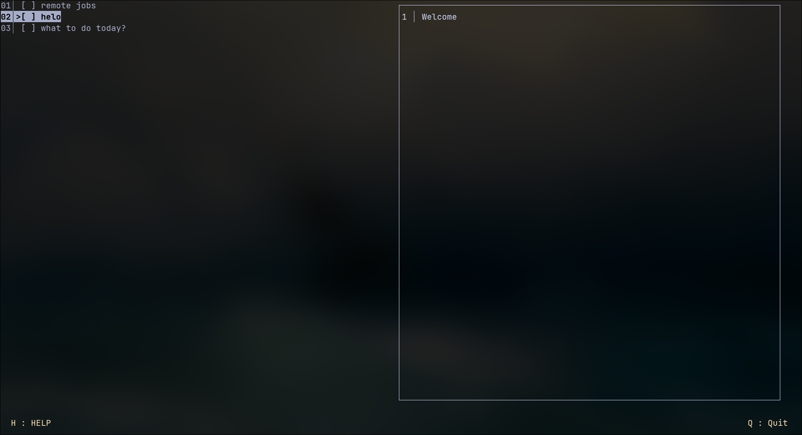
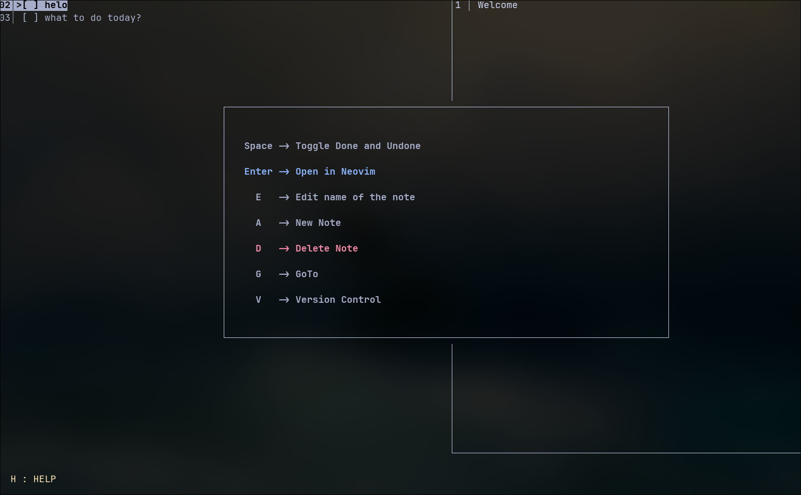
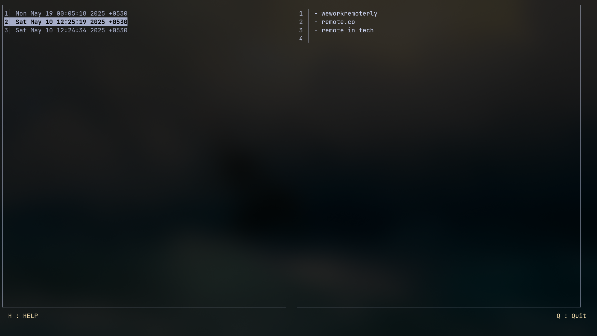
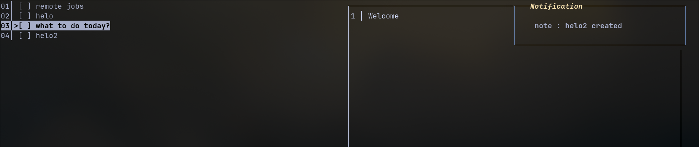

# TL;DR

- Lessons learned in modularity and design patterns.
- Next step: make backend and frontend modular (so I can swap `file_crud` and `crud(duckdb)`).

## Features

- **Version Control**  
  Uses Git to keep all changes saved by date and time.

  

- **Notifications**  
  Uses `send-notif` to send native system notifications.

  
